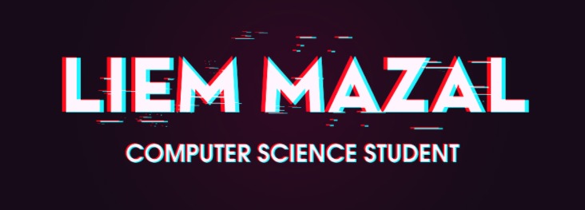

  <a>
:books:	 Currently on my last and 3rd year Computer Science  student (B.Sc.). :books:	
     
:computer:	 I am definitely open for collaborations :computer:	
     
:bulb:	 Love to learn new things. :bulb:	
   
  </a>
   
  
   
  
  
  

<h3> Contact </h3>

 
 
  
  

  

